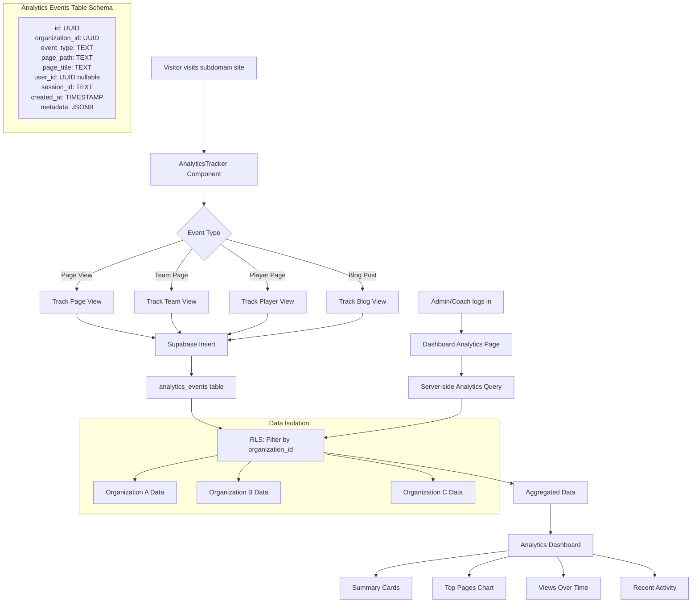

## Analytics System Architecture

### Data Flow
1. **Visitor Activity**: User visits any page on a subdomain organization site
2. **Automatic Tracking**: AnalyticsTracker component automatically captures the event
3. **Event Classification**: System determines event type (page_view, team_view, etc.)
4. **Secure Storage**: Event is stored in analytics_events table with organization isolation
5. **Dashboard Access**: Admins/coaches view analytics through dedicated dashboard
6. **Data Visualization**: Analytics are presented in charts, tables, and summary cards

### Key Features
- ✅ **Complete Data Isolation**: Each organization only sees their own analytics
- ✅ **Role-Based Access**: Only admins and coaches can view analytics  
- ✅ **Real-time Tracking**: Events are captured immediately when they occur
- ✅ **Privacy Conscious**: Anonymous tracking with optional user identification
- ✅ **Performance Optimized**: Non-blocking tracking and efficient queries
- ✅ **Comprehensive Metrics**: Page views, team/player engagement, and trends